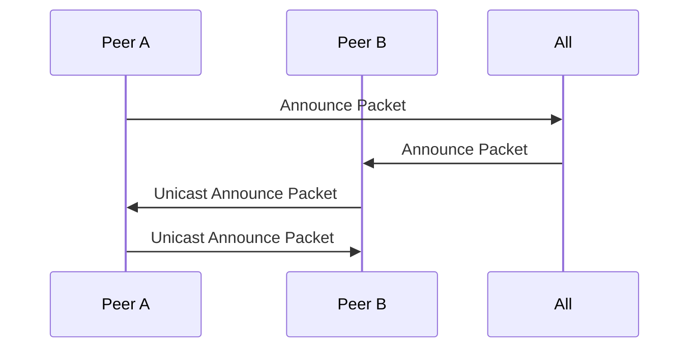
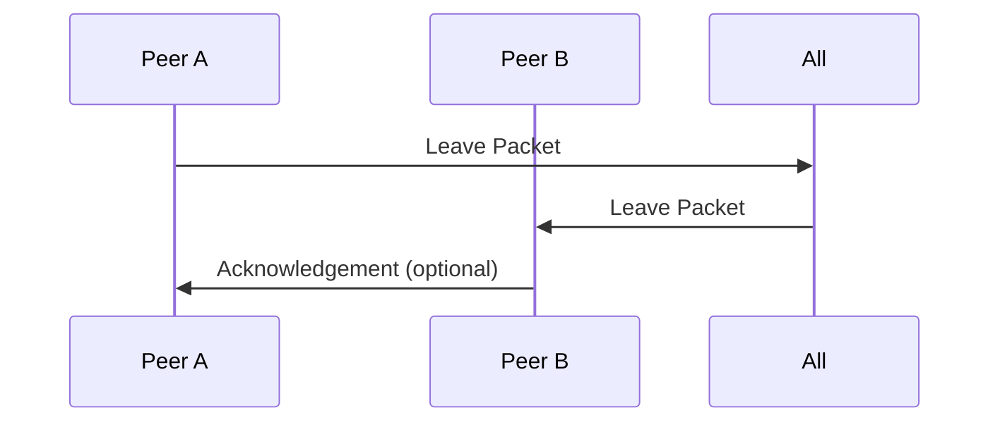
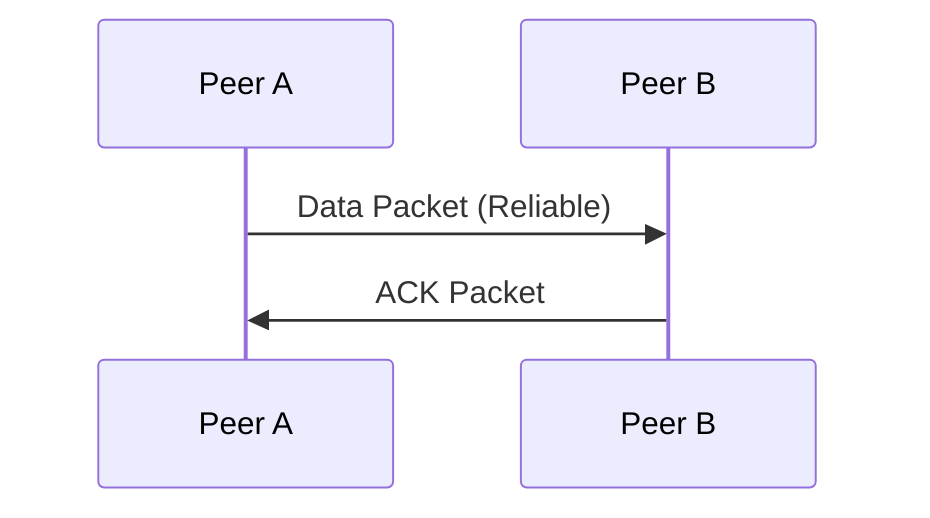
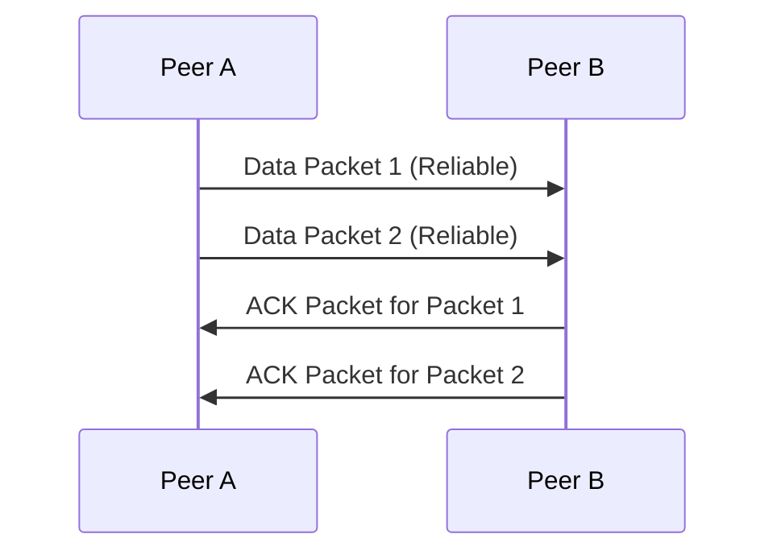
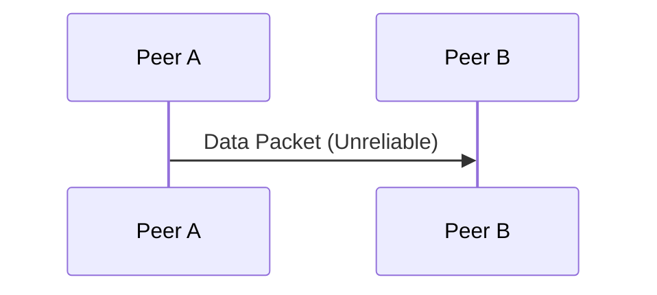
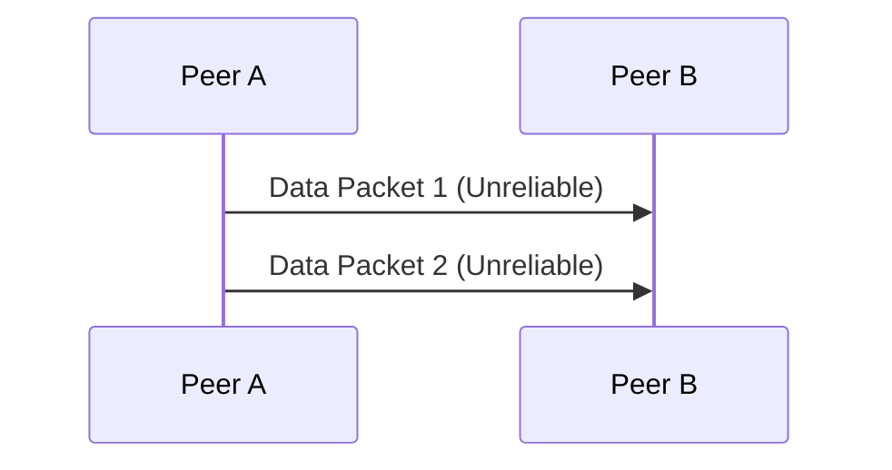
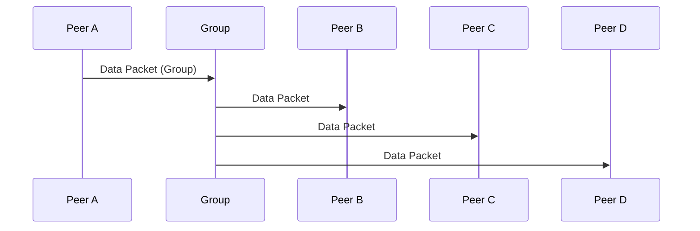

# NUClear Network Documentation

## Overview

The NUClear network is a UDP-based mesh network designed for efficient communication between nodes. It supports both reliable and unreliable message delivery, multicast, and unicast communication. This document provides an overview of how the NUClear network operates, including its key features and usage.

## UDP Basis of the Network

The NUClear network uses UDP (User Datagram Protocol) as its underlying transport mechanism. UDP is chosen for its low-latency and connectionless nature, making it suitable for real-time communication. However, UDP does not guarantee message delivery, order, or integrity, so NUClear implements additional mechanisms to handle these aspects.

## Mesh Network Formation

The NUClear network forms a mesh network where each node can communicate directly with any other node. This decentralized approach ensures robustness and scalability. Nodes discover each other through periodic announce packets and maintain connections by monitoring activity.

## Announce Packets

### Announce Rates

Nodes periodically send announce packets to inform others of their presence. The default announce interval is 500 milliseconds. These packets contain the node's name and other metadata.

### Unicast Responses from New Peers

When a node receives an announce packet from a new peer, it responds with a unicast announce packet to establish a bidirectional connection. This ensures that both nodes are aware of each other and can start communicating.

## Packet Targets

### Groups

Nodes can be organized into groups for targeted communication. A group is identified by a unique name, and nodes can join multiple groups. Messages can be sent to specific groups, ensuring that only relevant nodes receive them.

### All Group

The "all" group is a special group that includes all nodes in the network. Messages sent to the "all" group are broadcast to every node, making it useful for announcements and global messages.

## Sequence Diagrams

### New Peer Joins the Network

### Peer Leaves the Network

### Reliable Packet (Single Packet)

### Reliable Packet (Split)

### Unreliable Packet (Single Packet)

### Unreliable Packet (Split)

### Packet to a Group of Peers

## Conclusion

The NUClear network provides a robust and flexible communication framework for distributed systems. By leveraging UDP and implementing additional reliability mechanisms, it ensures efficient and reliable message delivery. Understanding the network's operation and features will help users effectively utilize it in their applications.
