# NUClear Network Documentation

## Overview

The NUClear network is a UDP-based mesh network designed for efficient communication between nodes.
It provides both reliable and unreliable message delivery, multicast, and unicast communication capabilities.
The network is particularly well-suited for real-time systems where low latency and efficient bandwidth usage are important.

## Network Configuration

The NUClear network uses two UDP ports for different purposes:

### Announce Port

Used for network discovery and peer management:

- Handles Announce and Leave packets
- Can be configured for different network topologies:
  - **Broadcast** (IPv4): Uses the broadcast address
  - **Multicast** (IPv4): Uses a multicast address in the range 239.0.0.0/8
  - **Multicast** (IPv6): Uses a multicast address in the range ff02::/16
  - **Unicast**: Uses the specific IP address of the peer
- Default port: 7447

### Data Port

Used for actual message payload transmission:

- Handles Data, Data Retransmission, ACK, and NACK packets
- Uses an ephemeral port (automatically assigned by the operating system)
- Benefits of ephemeral ports:
  - Allows multiple NUClearNet instances on the same system
  - Each instance gets a unique port number
  - No port conflicts between instances
  - Automatic port selection by the OS
- Binds to the same interface as the announce port

### Point-to-Point Topology (Unicast)

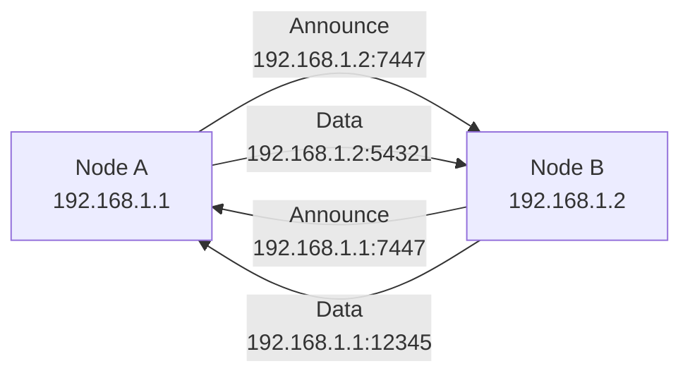

Direct communication between two nodes where each node must know the other's IP address. This topology has no automatic discovery - nodes must be explicitly configured.

Characteristics:

- Lowest network overhead
- No discovery traffic
- Requires manual configuration
- Best for stable, long-term connections
- Ideal for direct robot-to-robot communication

### Mesh Network Topology (Multicast/Broadcast)

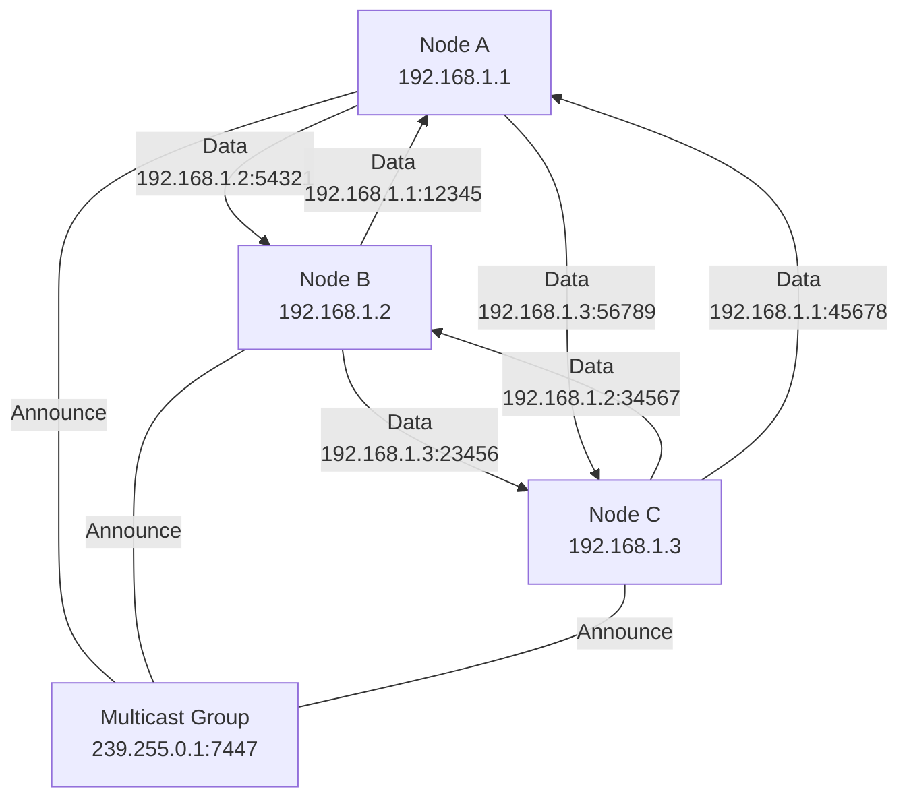

A self-organizing network where all nodes share the same multicast/broadcast address. Nodes can join and leave dynamically, making it suitable for changing network configurations.

Characteristics:

- Automatic peer discovery
- Higher network overhead due to discovery traffic
- Self-organizing network
- Nodes can join/leave at any time
- Best for multi-robot systems

### Network Discovery

The network discovery process works as follows:

#### Initial Announcement

- New nodes send announce packets to the configured address
- In multicast/broadcast mode, all nodes receive the announcement
- In unicast mode, only the target node receives the announcement

#### Peer Response

- Receiving nodes respond with their own announce packet
- Response is always sent as unicast to the announcing node
- Establishes bidirectional communication

#### Connection Maintenance

- Nodes periodically send announce packets
- Missing announces trigger connection timeout
- Leave packets signal clean disconnection

#### Node Naming and Groups

- Nodes are identified by their name in announce packets
- Multiple nodes can share the same name
- When a message is sent to a node name:
  - If multiple nodes have that name, all receive the message
  - This creates an implicit group based on node names
  - Useful for redundant systems or load balancing
- Example: Two vision processing nodes named "vision" will both receive messages sent to "vision"

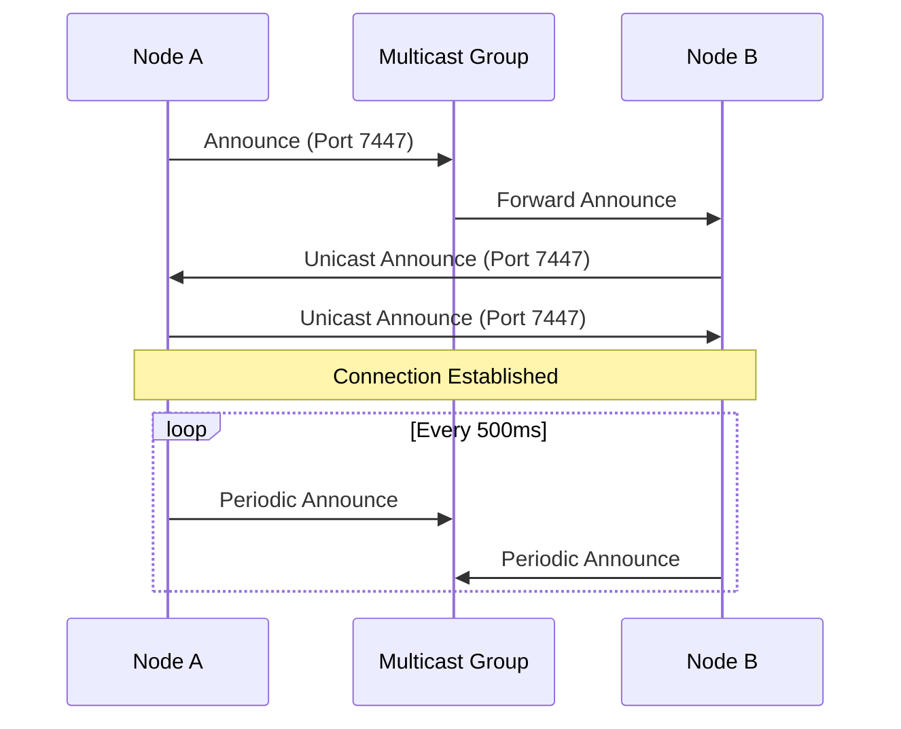

## Network Architecture

### UDP Basis

The network uses UDP as the underlying transport protocol for low-latency communication.
It implements custom reliability mechanisms on top of UDP.
The system supports both IPv4 and IPv6 addressing.
It handles network MTU (Maximum Transmission Unit) considerations automatically.

### Network Formation

Nodes join the network by binding to a specified address and port.
Each node maintains a list of known peers and their connection states.
Network discovery happens through periodic announce packets.
Connections are bidirectional - both nodes must be aware of each other.

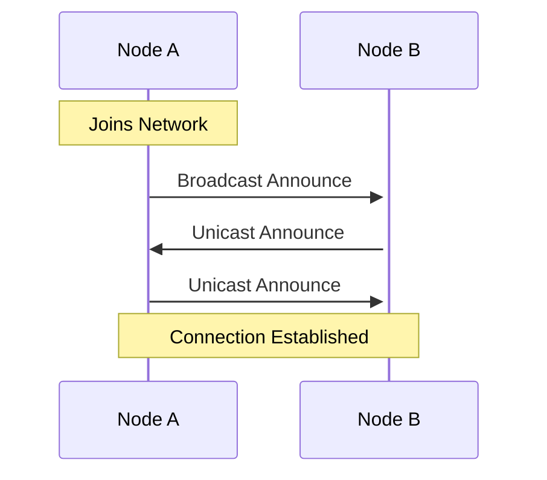

## Protocol Design

### Packet Summary

| Type       | Code | Purpose                        |
| ---------- | ---- | ------------------------------ |
| Announce   | 0x01 | Peer discovery                 |
| Leave      | 0x02 | Clean disconnect               |
| Data       | 0x03 | Payload message (initial)      |
| Retransmit | 0x04 | Payload message (retry)        |
| ACK        | 0x05 | Acknowledge received fragments |
| NACK       | 0x06 | Request retransmission         |

### Packet Types

The network uses several packet types defined in the wire protocol:

#### Announce Packet

This packet is used for network discovery.
It contains node name and metadata.
It is sent periodically (default: every 500ms).

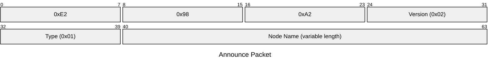

The Announce Packet is used for network discovery and contains:

- **Magic**: Fixed value 0xE2 0x98 0xA2 (radioactive symbol in UTF-8)
- **Version**: Protocol version (0x02)
- **Type**: Packet type (0x01 for Announce)
- **Node Name**: UTF-8 encoded name of the node

#### Leave Packet

This packet signals node departure from network.
It triggers cleanup of peer connections.

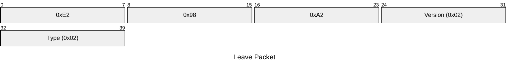

#### Data Packet

This packet carries actual message payload. The same structure is used for both initial transmission (`DATA = 3`) and retransmission (`DATA_RETRANSMISSION = 4`). The type field is the only difference between these two variants.

When a packet needs to be retransmitted (due to timeout or NACK), it is sent as a `DATA_RETRANSMISSION` type. This allows receivers to:

- Distinguish between new packets and retransmissions
- Avoid processing duplicate packets that were already received
- Handle retransmissions differently from initial transmissions

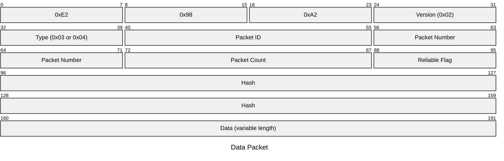

The Data Packet carries the actual message payload and contains:

- **Magic**: Fixed value 0xE2 0x98 0xA2
- **Version**: Protocol version (0x02)
- **Type**: Packet type (0x03 for Data, 0x04 for Data Retransmission)
- **Packet ID**: Unique identifier for the message, used to match fragments
- **Packet Number**: Index of this fragment (0 to count-1)
- **Packet Count**: Total number of fragments in the message
- **Reliable Flag**: 1 for reliable delivery, 0 for unreliable
- **Hash**: Message type identifier, used for routing
- **Data**: The actual fragment payload (variable length)

#### ACK Packet

This packet acknowledges received packets.
It contains bitfield of received packet fragments.

The ACK Packet acknowledges received fragments and contains:

- **Magic**: Fixed value 0xE2 0x98 0xA2
- **Version**: Protocol version (0x02)
- **Type**: Packet type (0x05 for ACK)
- **Packet ID**: Matches the ID of the message being acknowledged
- **Packet Number**: Last received fragment number
- **Packet Count**: Total fragments expected in the message
- **Bitfield**: One bit per fragment (size = packet_count/8 bytes), 1 indicates received, 0 indicates missing

#### NACK Packet

This packet is used to request retransmission of packets that were previously acknowledged but later found to be corrupted or invalid. It effectively "undoes" previous ACKs for specific fragments.

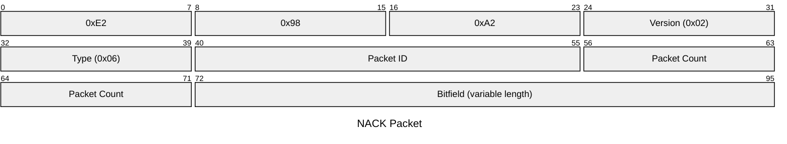

The NACK Packet requests retransmission of fragments and contains:

- **Magic**: Fixed value 0xE2 0x98 0xA2
- **Version**: Protocol version (0x02)
- **Type**: Packet type (0x06 for NACK)
- **Packet ID**: Matches the ID of the message needing retransmission
- **Packet Count**: Total fragments expected in the message
- **Bitfield**: One bit per fragment (size = packet_count/8 bytes), 1 indicates needs retransmission, 0 indicates correctly received

## Packet Fragmentation

Large messages are split into smaller fragments to fit within network MTU limits. This process is independent of reliability - both reliable and unreliable messages can be fragmented.

### Message Splitting

Messages larger than MTU are split into fragments. Each fragment is assigned a sequence number (0 to count-1) and all fragments share the same packet ID. Fragments can be reassembled in any order.

### Fragment Identification

Each fragment is identified by several fields:

- **Packet ID**: Unique identifier for the message group
- **Packet Number**: Sequence number of this fragment (0 to count-1)
- **Packet Count**: Total number of fragments in the message
- **Hash**: Message type identifier, used for routing

### Cache Management

Fragments are cached until the complete message is received. The cache is managed to prevent memory buildup:

- Incomplete messages are removed from cache if:
  - A new message with the same ID but different count is received
  - Cache becomes corrupted (fragment numbers exceed count)
  - Timeout occurs (configurable)
- Cache cleanup prevents memory buildup from lost fragments

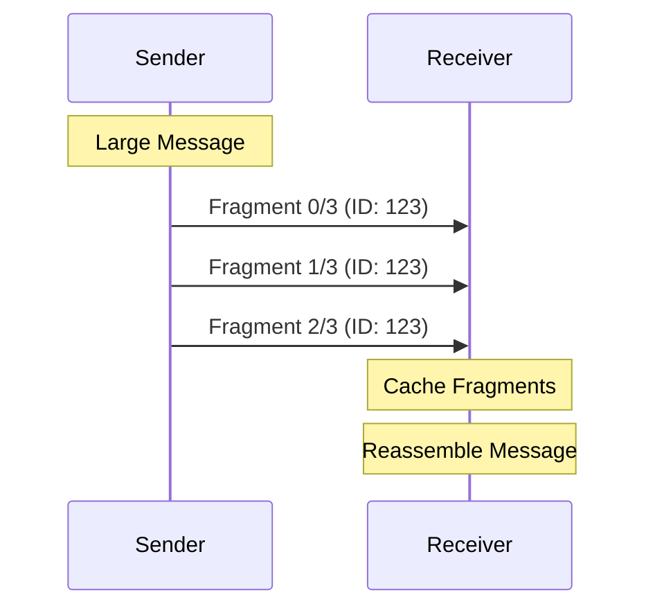

## Reliability Mechanisms

### Reliable Message Delivery

#### Acknowledgement System

The system uses ACK packets to track received fragments. Each ACK packet contains:

- A bitfield where each bit represents a fragment
- 1 indicates the fragment was received
- 0 indicates the fragment is missing
- Bitfield size is calculated as packet_count/8 bytes

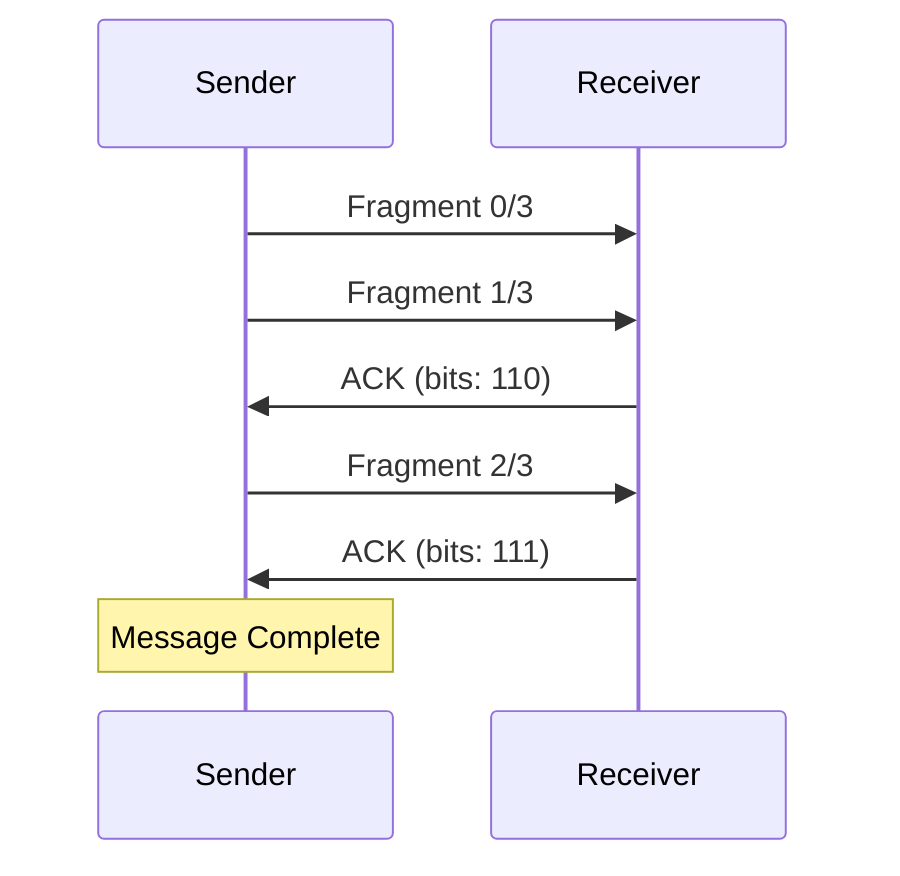

#### Retransmission

The system handles missing fragments through retransmission:

- Unacknowledged fragments are retransmitted
- Retransmission uses exponential backoff
- Backoff timing is based on round-trip time estimates
- Kalman filter helps predict optimal retransmission timing

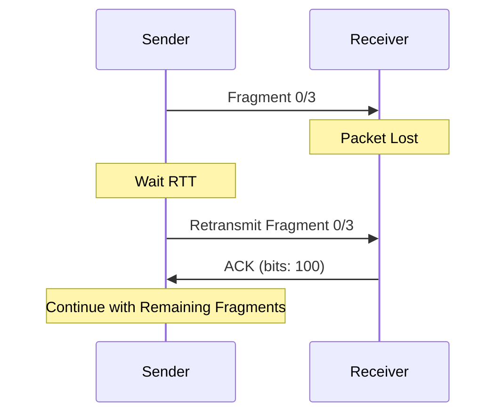

#### Round-Trip Time Estimation

The system maintains accurate timing information:

- System maintains round-trip time estimates for each peer
- Uses Kalman filter to smooth out network jitter
- Helps optimize retransmission timing
- Adapts to changing network conditions

### Unreliable Message Delivery

Messages sent without reliability flag skip ACK/NACK.
No retransmission attempts are made.
This provides lower overhead, suitable for real-time data.

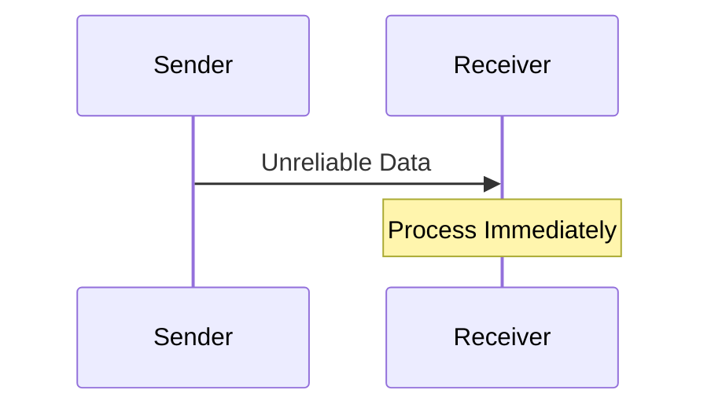

## Network Management

### Connection Management

1. **Peer Discovery**

Nodes send periodic announce packets.
New peers respond with unicast announce.
Connection timeout occurs after 2 seconds of inactivity.

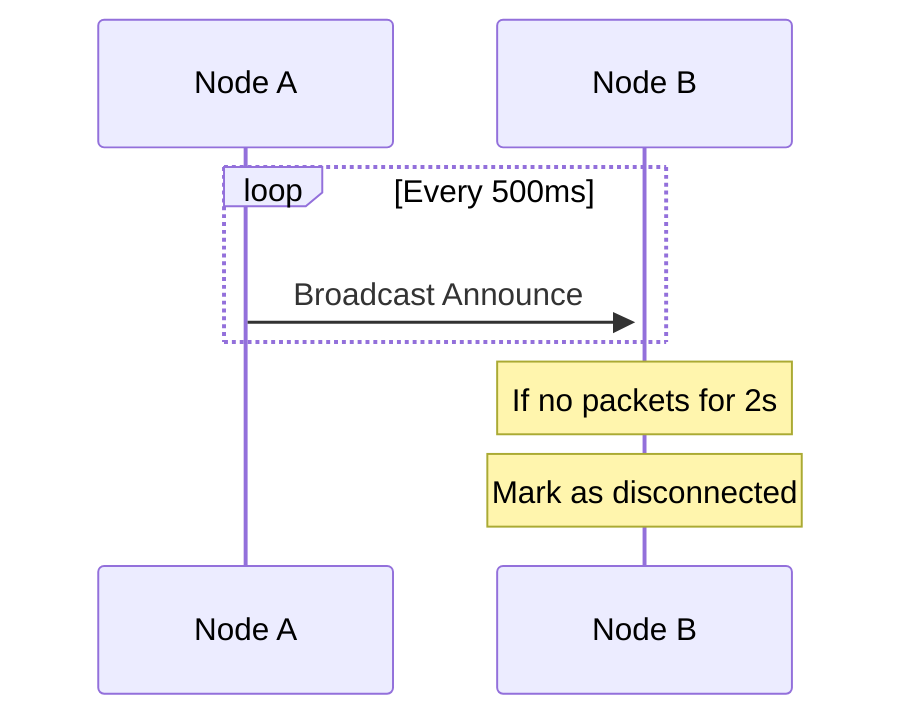

2. **Group Management**

Nodes can belong to multiple groups.
Messages can be targeted to specific groups.
A special "all" group exists for broadcast messages.

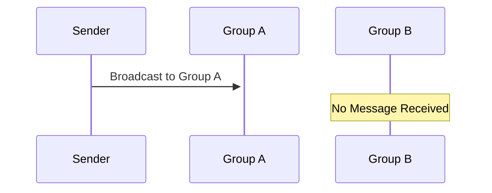

### Performance Optimizations

1. **MTU Handling**

The system automatically calculates optimal packet size.
It accounts for IP and UDP headers.
It fragments large messages appropriately.

2. **Round-Trip Time Estimation**

The system uses Kalman filter for RTT prediction.
It adapts to network conditions.
It helps optimize retransmission timing.

## Best Practices

1. **Network Configuration**

Choose appropriate MTU size for your network.
Consider using multicast for discovery in larger networks.
Set appropriate announce intervals based on network stability.

2. **Message Handling**

Use reliable delivery for critical messages.
Use unreliable delivery for real-time data.
Consider message size and fragmentation overhead.

3. **Error Handling**

Implement proper error handling for network operations.
Monitor connection timeouts.
Handle packet loss gracefully.
