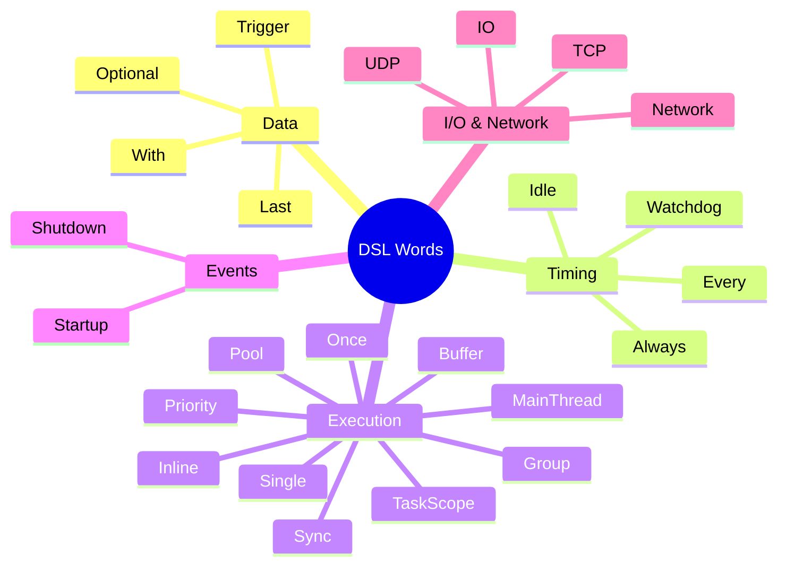

# DSL Words

NUClear's domain-specific language is expressed through template arguments to `on<>()`. Each DSL word declares an aspect of a reaction's behaviour — what triggers it, what data it needs, and how it executes.

```cpp
on<Trigger<T>, With<U>, Single, Priority::HIGH>().then([](const T& t, const U& u) {
    // ...
});
```

DSL words combine freely in a single `on<>` statement. The runtime fuses their semantics at compile time.

For a deeper explanation of how the DSL system works, see [DSL System](../../explanation/dsl-system.md). To create custom DSL words, see [Extensions](../extensions/index.md).



## Data (binding & access)

| Word | Description | Link |
|------|-------------|------|
| `Trigger<T>` | Primary event trigger; fires reaction when `T` is emitted | [Trigger](trigger.md) |
| `With<T>` | Provides latest `T` alongside trigger data (doesn't trigger) | [With](with.md) |
| `Optional<DSLWords...>` | Allows reaction to proceed even if wrapped data is unavailable | [Optional](optional.md) |
| `Last<N, DSLWords...>` | Stores the last N messages, provides ordered list | [Last](last.md) |

## Timing

| Word | Description | Link |
|------|-------------|------|
| `Every<ticks, period>` | Periodic execution at fixed intervals | [Every](every.md) |
| `Always` | Continuous execution in a dedicated thread | [Always](always.md) |
| `Idle<PoolType>` | Executes when a thread pool is idle | [Idle](idle.md) |
| `Watchdog<Group, ticks, period>` | Timeout trigger if not serviced | [Watchdog](watchdog.md) |

## Execution control

| Word | Description | Link |
|------|-------------|------|
| `Buffer<N>` | Allow up to N concurrent instances | [Buffer](buffer.md) |
| `Single` | Only one instance at a time (equivalent to `Buffer<1>`) | [Single](single.md) |
| `Once` | Run only once then unbind | [Once](once.md) |
| `Inline` | Control inline vs queued execution (`ALWAYS`/`NEVER`) | [Inline](inline.md) |
| `Pool<PoolType>` | Route to custom thread pool | [Pool](pool.md) |
| `Group<GroupType>` | Concurrency limiting within a named group | [Group](group.md) |
| `Sync<SyncGroup>` | Mutual exclusion (`Group` with concurrency=1) | [Sync](sync.md) |
| `MainThread` | Execute on the main thread | [MainThread](main-thread.md) |
| `Priority` | Set task scheduling priority (`REALTIME`/`HIGH`/`NORMAL`/`LOW`/`IDLE`) | [Priority](priority.md) |
| `TaskScope<Group>` | Track task execution context | [TaskScope](task-scope.md) |

## Events

| Word | Description | Link |
|------|-------------|------|
| `Startup` | Triggered when PowerPlant starts | [Startup](startup.md) |
| `Shutdown` | Triggered during system shutdown | [Shutdown](shutdown.md) |

## I/O & Network

| Word | Description | Link |
|------|-------------|------|
| `IO` | File descriptor events (`READ`/`WRITE`/`CLOSE`/`ERROR`) | [IO](io.md) |
| `TCP` | TCP connection listener | [TCP](tcp.md) |
| `UDP` | UDP packet listener (unicast/broadcast/multicast) | [UDP](udp.md) |
| `Network<T>` | Receive type `T` from NUClear network peers | [Network](network.md) |
