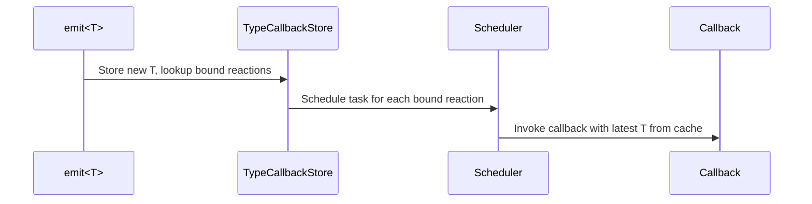

# Trigger

> Binds a reaction to fire every time a given type is emitted, providing the most recent data.

## Syntax

```cpp
on<Trigger<T>>().then([](const T& value) { /* ... */ });

on<Trigger<T1, T2>>().then([](const T1& a, const T2& b) { /* ... */ });
```

## Parameters

| Parameter | Description                          |
| --------- | ------------------------------------ |
| `T`       | The datatype that triggers the reaction when emitted |

Multiple types may be provided as separate template arguments: `Trigger<T1, T2, ...>`.

## Behavior

When `T` is emitted, all reactions registered with `Trigger<T>` are scheduled for execution.
The callback receives `const T&` (a dereferenced `std::shared_ptr<const T>`) containing the most recent emission of that type from the data store.

If `T` has never been emitted, the task is dropped and the callback is not invoked.

### Multi-Trigger

`Trigger<T1, T2>` fires when **any** of the listed types is emitted.
Regardless of which type triggered the reaction, the latest data for **all** listed types is provided to the callback.
If any of the triggered types has never been emitted, the task is dropped.



### Implementation

`Trigger<T>` is composed of two operations via `Fusion`:

- **`TypeBind<T>`** — registers the reaction in the callback store so it is notified on emission of `T`.
- **`CacheGet<T>`** — retrieves the most recent `T` from the data store at task execution time.

Data access is thread-safe; the underlying `std::shared_ptr<const T>` ensures the data remains valid for the lifetime of the callback.

## Example

```cpp
struct SensorReading {
    double value;
};

struct Command {
    int id;
};

// Single trigger
on<Trigger<SensorReading>>().then([](const SensorReading& reading) {
    // Fires every time a SensorReading is emitted
});

// Multi-trigger
on<Trigger<SensorReading, Command>>().then([](const SensorReading& reading, const Command& cmd) {
    // Fires when EITHER SensorReading or Command is emitted
    // Both arguments always contain the most recent data
});
```

## Notes

- The callback argument is a reference into a shared pointer. Do not store the reference beyond the callback's lifetime; copy the data or capture the shared pointer via [With](with.md) if needed.
- To access data without triggering on it, use [With](with.md).
- To allow missing data instead of dropping the task, wrap the type in [Optional](optional.md).
- `Trigger<T1, T2>` is equivalent to `Trigger<T1>, Trigger<T2>` — both fire on any of the listed types.

## See Also

- [With](with.md) — access data without triggering
- [Optional](optional.md) — permit missing data instead of dropping the task
- [emit/Local](../emit/local.md) — emit data visible only within the current PowerPlant
