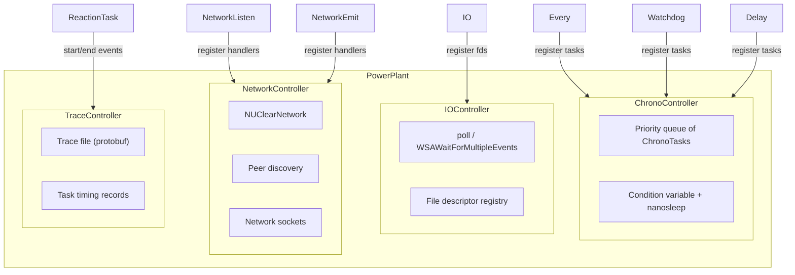

# Built-in Extensions

NUClear ships with four extension reactors that are installed into the PowerPlant at startup. These are ordinary reactors — they use the same `on<>()` DSL as user code — but they provide core system services that other DSL words depend on.

## ChronoController

Manages all time-based operations in NUClear.

**Handles:**

- `Every` — periodic reactions that fire at fixed intervals
- `Watchdog` — timeout reactions that fire if not serviced within a deadline
- `Delay` — deferred emissions that occur after a specified duration

**Implementation:**

The controller maintains a sorted priority queue of `ChronoTask` items, each with a target fire time and a callback. A dedicated thread sleeps until the next task is due, using a combination of condition variable waits (for coarse timing) and nanosleep (for fine timing accuracy).

When a time-based word's `bind` is called, it submits a `ChronoTask` to this controller. The task's callback typically re-submits itself (for `Every`) or triggers a reaction (for `Watchdog` expiry).

**Key internals:**

| Component | Purpose |
|-----------|---------|
| `std::vector<ChronoTask>` | Tasks sorted by next fire time |
| `std::condition_variable` | Wakes the timing thread when tasks change |
| `cv_accuracy` | Measured accuracy of condition variable waits |
| `ns_accuracy` | Measured accuracy of nanosleep calls |

The controller also responds to `TimeTravel` messages, which shift the clock and re-evaluate all pending tasks.

## IOController

Monitors file descriptors for IO readiness events and triggers corresponding reactions.

**Handles:**

- `IO` — reactions that fire when a file descriptor becomes readable, writable, or errors

**Implementation:**

Uses platform-native polling mechanisms:

- **POSIX (Linux/macOS):** `poll()` with `pollfd` arrays
- **Windows:** `WSAWaitForMultipleEvents` with `WSAEVENT` handles

A dedicated thread blocks on the polling call. When events are detected on registered file descriptors, the controller creates tasks for the corresponding reactions, passing the event flags through `ThreadStore` so the `get` method can report which specific events occurred.

**Key internals:**

| Component | Purpose |
|-----------|---------|
| `tasks_t` | Registry of fd → reaction mappings |
| `notifier_t` | Pipe/event used to wake the poll thread when registrations change |
| `listening_events` | What the task is waiting for |
| `waiting_events` | Events ready to fire |
| `processing_events` | Events currently being handled |

The controller coalesces multiple reactions on the same fd into a single poll entry and dispatches events to the correct reactions based on their registered interest masks.

## NetworkController

Bridges the low-level `NUClearNetwork` protocol into NUClear's reaction system.

**Handles:**

- `NetworkConfiguration` — configures the network name, multicast group, and port
- `NetworkListen` — registers reactions for incoming network messages by type hash
- `NetworkEmit` — sends serialized data to network peers

**Implementation:**

Wraps a `NUClearNetwork` instance that implements peer discovery (via multicast announcements) and reliable/unreliable message delivery. The controller:

1. Listens for `NetworkConfiguration` messages to initialize/reconfigure the network
2. Registers `IO` reactions on network sockets so incoming data triggers processing
3. Maintains a map of type hashes to reactions for dispatching received messages
4. Provides callbacks for peer join/leave events that emit `NetworkPeer` messages

**Key internals:**

| Component | Purpose |
|-----------|---------|
| `NUClearNetwork network` | Low-level networking (discovery, serialization, transport) |
| `std::multimap<uint64_t, Reaction>` | Type hash → interested reactions |
| `listen_handles` | IO reactions watching network sockets |
| `process_handle` | Reaction for timed network maintenance tasks |

## TraceController

Records task execution traces for performance profiling and debugging.

**Handles:**

- Task start/end events from the threading system
- Thread identification and naming
- Trace file output in protobuf format (compatible with Perfetto)

**Implementation:**

Listens for task lifecycle events and writes trace records to a file. Each record captures the reaction identity, start/end timestamps, and which thread the task ran on. The output uses a protobuf wire format compatible with the Perfetto trace viewer.

**Key internals:**

| Component | Purpose |
|-----------|---------|
| `TracePool` | Dedicated single-thread pool (persistent, non-idle-counting) |
| `StringInterner` | Deduplicates reaction/thread name strings in the trace file |
| `write_trace_packet()` | Serializes and writes individual trace events |
| Process/thread track IDs | Unique identifiers for the trace hierarchy |

The trace pool is marked `persistent = true` so it continues recording events even during shutdown, capturing the full lifecycle of the system.
