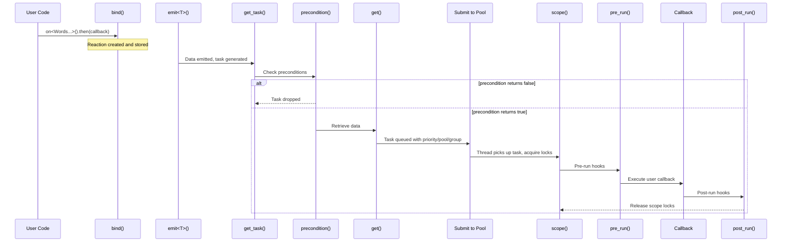

# Extension Points

Extension points are static template methods that a DSL word can implement to hook into different stages of the reaction lifecycle. The Fusion Engine discovers which points each word implements and combines them according to point-specific strategies.

Every extension point receives a `DSL` template parameter — the full fused type of all words in the `on<>()` statement. This gives each word access to the complete DSL context.

## Lifecycle Overview



## Reference

### bind

Called once when the reaction is created (at the `.then()` call site).

```cpp
template <typename DSL>
static void bind(const std::shared_ptr<threading::Reaction>& reaction, Args... args)
```

| Aspect | Detail |
|--------|--------|
| **When** | Reaction registration time |
| **Returns** | `void` (return values wrapped into empty tuple) |
| **Fusion** | All words with `bind` are called sequentially via FunctionFusion. Runtime arguments are consumed left-to-right. |

Use `bind` to register the reaction with event sources (e.g., add to a `TypeCallbackStore`, register a file descriptor, set up a timer).

```cpp
struct Trigger {
    template <typename DSL>
    static void bind(const std::shared_ptr<threading::Reaction>& reaction) {
        TypeCallbackStore<T>::add(reaction);
    }
};
```

---

### get

Called at task dispatch to retrieve data for the user's callback.

```cpp
template <typename DSL>
static T get(threading::ReactionTask& task)
```

| Aspect | Detail |
|--------|--------|
| **When** | After preconditions pass, before the task is submitted |
| **Returns** | Data of any type — passed as callback argument |
| **Fusion** | Each word's return is concatenated into a flattened tuple. The tuple elements become the callback parameters. |

If `get` returns `nullptr` for a pointer type, the task is dropped (unless wrapped in `Optional`).

```cpp
struct With {
    template <typename DSL>
    static std::shared_ptr<const T> get(threading::ReactionTask& /*task*/) {
        return DataStore<T>::get();
    }
};
```

---

### precondition

Called before a task is queued. If any precondition returns `false`, the task is dropped.

```cpp
template <typename DSL>
static bool precondition(threading::ReactionTask& task)
```

| Aspect | Detail |
|--------|--------|
| **When** | After task creation, before get/submission |
| **Returns** | `bool` |
| **Fusion** | Logical AND with short-circuit evaluation. First `false` stops evaluation. |

```cpp
struct Single {
    template <typename DSL>
    static bool precondition(threading::ReactionTask& task) {
        // Only allow one instance at a time
        return task.reaction->active_tasks.load() == 0;
    }
};
```

---

### pre_run

Called immediately before the user callback executes, after the task has been picked up by a thread.

```cpp
template <typename DSL>
static void pre_run(threading::ReactionTask& task)
```

| Aspect | Detail |
|--------|--------|
| **When** | After scope acquisition, before callback |
| **Returns** | `void` |
| **Fusion** | All words called sequentially |

---

### post_run

Called immediately after the user callback completes.

```cpp
template <typename DSL>
static void post_run(threading::ReactionTask& task)
```

| Aspect | Detail |
|--------|--------|
| **When** | After callback, before scope release |
| **Returns** | `void` |
| **Fusion** | All words called sequentially |

---

### scope

Returns an RAII lock object that is held for the duration of the callback execution (including `pre_run` and `post_run`).

```cpp
template <typename DSL>
static Lock scope(threading::ReactionTask& task)
```

| Aspect | Detail |
|--------|--------|
| **When** | Acquired before `pre_run`, released after `post_run` |
| **Returns** | Any RAII type (held in a tuple until task completion) |
| **Fusion** | All scope objects are acquired and held simultaneously via FunctionFusion |

```cpp
struct Sync {
    template <typename DSL>
    static std::unique_lock<std::mutex> scope(threading::ReactionTask& /*task*/) {
        return std::unique_lock<std::mutex>(mutex);
    }
};
```

---

### priority

Returns the priority level for this task in the scheduling queue.

```cpp
template <typename DSL>
static int priority(threading::ReactionTask& task)
```

| Aspect | Detail |
|--------|--------|
| **When** | Task creation |
| **Returns** | `int` (higher values = higher priority) |
| **Fusion** | Maximum value wins |

```cpp
struct Priority<NUClear::HIGH> {
    template <typename DSL>
    static int priority(threading::ReactionTask& /*task*/) {
        return 1000;
    }
};
```

---

### pool

Specifies which thread pool the task should execute on.

```cpp
template <typename DSL>
static std::shared_ptr<const ThreadPoolDescriptor> pool(threading::ReactionTask& task)
```

| Aspect | Detail |
|--------|--------|
| **When** | Task creation |
| **Returns** | Pool descriptor (name + concurrency) |
| **Fusion** | Exactly one pool allowed. If multiple words provide `pool`, a runtime exception is thrown. |

```cpp
struct MainThread {
    template <typename DSL>
    static std::shared_ptr<const ThreadPoolDescriptor> pool(threading::ReactionTask& /*task*/) {
        return main_thread_pool;
    }
};
```

---

### group

Specifies concurrency group(s) that the task belongs to. Groups limit how many tasks sharing a group can run simultaneously.

```cpp
template <typename DSL>
static std::set<std::shared_ptr<const GroupDescriptor>> group(threading::ReactionTask& task)
```

| Aspect | Detail |
|--------|--------|
| **When** | Task creation |
| **Returns** | Set of group descriptors |
| **Fusion** | Set union — all groups from all words are merged |

---

### run_inline

Controls whether the task can be executed inline (on the emitting thread) rather than being submitted to a pool.

```cpp
template <typename DSL>
static util::Inline run_inline(threading::ReactionTask& task)
```

| Aspect | Detail |
|--------|--------|
| **When** | Task creation |
| **Returns** | `Inline::ALWAYS`, `Inline::NEVER`, or `Inline::NEUTRAL` |
| **Fusion** | Must agree. `ALWAYS` + `NEVER` throws. `NEUTRAL` defers to non-neutral words. |

## Summary Table

| Point | Signature | When | Returns | Fusion Strategy |
|-------|-----------|------|---------|-----------------|
| `bind` | `bind<DSL>(reaction, args...)` | Registration | void | Sequential (FunctionFusion) |
| `get` | `get<DSL>(task)` | Dispatch | data | Tuple concatenation |
| `precondition` | `precondition<DSL>(task)` | Pre-queue | bool | AND (short-circuit) |
| `pre_run` | `pre_run<DSL>(task)` | Pre-callback | void | Sequential |
| `post_run` | `post_run<DSL>(task)` | Post-callback | void | Sequential |
| `scope` | `scope<DSL>(task)` | Around callback | RAII lock | All held (FunctionFusion) |
| `priority` | `priority<DSL>(task)` | Task creation | int | Maximum |
| `pool` | `pool<DSL>(task)` | Task creation | descriptor | Exactly one |
| `group` | `group<DSL>(task)` | Task creation | set | Set union |
| `run_inline` | `run_inline<DSL>(task)` | Task creation | Inline enum | Must agree |
