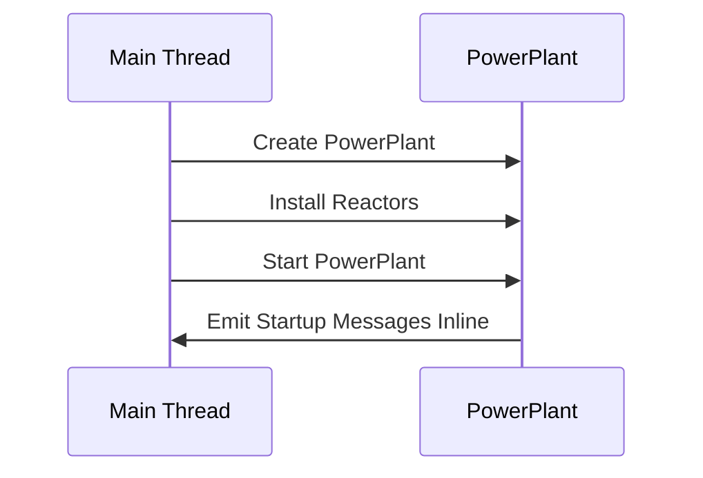
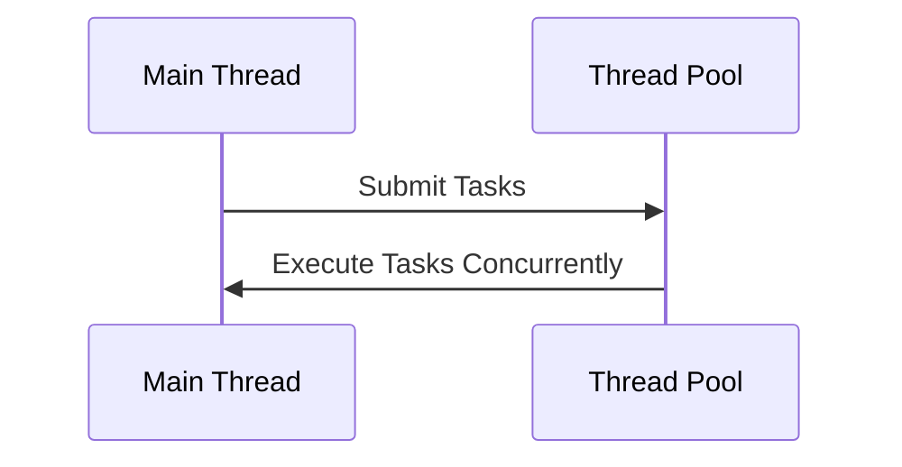
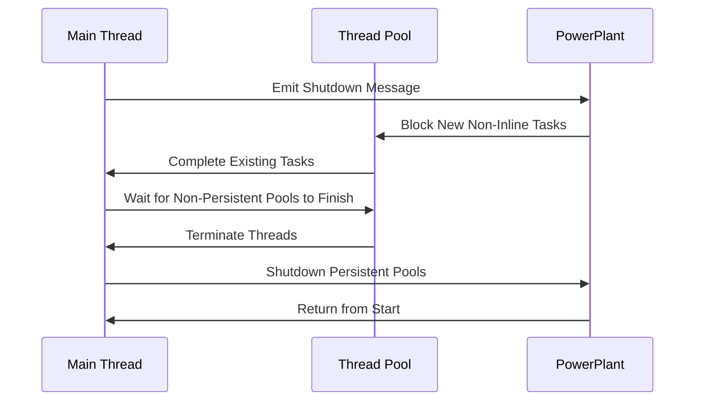
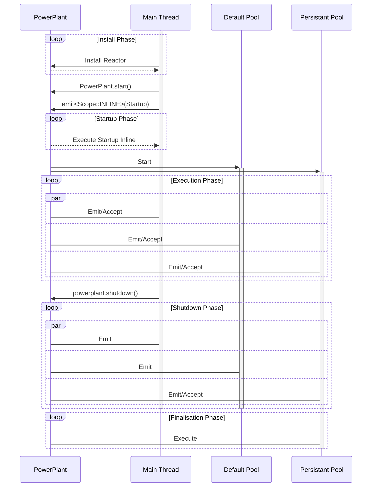

TrentHouliston: @workspace Please prepare a document describing the progression of execution stages in NUClear works. This is for documentation for a user of the NUClear system so describe it from the perspective of someone using the system rather than for implementers of the system. Ensure you have sufficient detail so that a new user of the system will understand what feature are available to them and will know how to use them.

Topics that should be covered are as follows, but also include any other topics that you think are important to cover for describing how NUClear works.

- Single threaded main sequence where:
  - `PowerPlant` is created
  - `Reactors are installed
- Powerplant Start Up
  - Single threaded main thread
  - Startup messages are emitted Inline
- Multithreaded execution phase
  - system operates an normal
  - tasks executed as normal on thread pools
- Shutdown sequence
  - shutdown message emitted at lowest priority
  - new non inline tasks blocked on normal pools
  - all tasks still allowed on persistent pools
  - main thread waits for non persistent pools to finish all tasks and the threads terminate
  - persistent pool threads are told to shutdown once they exhaust all tasks
    - main thread returns from powerplant.start();

Additionally please make diagrams using the mermaid diagram format to illustrate the concepts you are explaining.
Specifically ensure you have a sequence diagram showing the interaction between the main thread and the thread pools at each stage of execution.

Workspace: # NUClear System Execution Stages

This document describes the progression of execution stages in the NUClear system from the perspective of a user. It provides sufficient detail to help new users understand the available features and how to use them effectively.

## Single Threaded Main Sequence

### PowerPlant Creation

The first step in setting up a NUClear system is creating a [`PowerPlant`](command:_github.copilot.openSymbolFromReferences?%5B%22PowerPlant%22%2C%5B%7B%22uri%22%3A%7B%22%24mid%22%3A1%2C%22fsPath%22%3A%22%2FUsers%2Ftrenthouliston%2FCode%2FNUClear%2Fdocs%2Fcomponents.rst%22%2C%22external%22%3A%22file%3A%2F%2F%2FUsers%2Ftrenthouliston%2FCode%2FNUClear%2Fdocs%2Fcomponents.rst%22%2C%22path%22%3A%22%2FUsers%2Ftrenthouliston%2FCode%2FNUClear%2Fdocs%2Fcomponents.rst%22%2C%22scheme%22%3A%22file%22%7D%2C%22pos%22%3A%7B%22line%22%3A3%2C%22character%22%3A61%7D%7D%2C%7B%22uri%22%3A%7B%22%24mid%22%3A1%2C%22fsPath%22%3A%22%2FUsers%2Ftrenthouliston%2FCode%2FNUClear%2Fdocs%2Fstartup.rst%22%2C%22external%22%3A%22file%3A%2F%2F%2FUsers%2Ftrenthouliston%2FCode%2FNUClear%2Fdocs%2Fstartup.rst%22%2C%22path%22%3A%22%2FUsers%2Ftrenthouliston%2FCode%2FNUClear%2Fdocs%2Fstartup.rst%22%2C%22scheme%22%3A%22file%22%7D%2C%22pos%22%3A%7B%22line%22%3A16%2C%22character%22%3A12%7D%7D%2C%7B%22uri%22%3A%7B%22%24mid%22%3A1%2C%22fsPath%22%3A%22%2FUsers%2Ftrenthouliston%2FCode%2FNUClear%2Fdocs%2Fstartup.rst%22%2C%22external%22%3A%22file%3A%2F%2F%2FUsers%2Ftrenthouliston%2FCode%2FNUClear%2Fdocs%2Fstartup.rst%22%2C%22path%22%3A%22%2FUsers%2Ftrenthouliston%2FCode%2FNUClear%2Fdocs%2Fstartup.rst%22%2C%22scheme%22%3A%22file%22%7D%2C%22pos%22%3A%7B%22line%22%3A104%2C%22character%22%3A10%7D%7D%2C%7B%22uri%22%3A%7B%22%24mid%22%3A1%2C%22fsPath%22%3A%22%2FUsers%2Ftrenthouliston%2FCode%2FNUClear%2Fdocs2%2Fsystem%2FStart%20Up.md%22%2C%22external%22%3A%22file%3A%2F%2F%2FUsers%2Ftrenthouliston%2FCode%2FNUClear%2Fdocs2%2Fsystem%2FStart%2520Up.md%22%2C%22path%22%3A%22%2FUsers%2Ftrenthouliston%2FCode%2FNUClear%2Fdocs2%2Fsystem%2FStart%20Up.md%22%2C%22scheme%22%3A%22file%22%7D%2C%22pos%22%3A%7B%22line%22%3A5%2C%22character%22%3A5%7D%7D%2C%7B%22uri%22%3A%7B%22%24mid%22%3A1%2C%22fsPath%22%3A%22%2FUsers%2Ftrenthouliston%2FCode%2FNUClear%2Fsrc%2FEnvironment.hpp%22%2C%22external%22%3A%22file%3A%2F%2F%2FUsers%2Ftrenthouliston%2FCode%2FNUClear%2Fsrc%2FEnvironment.hpp%22%2C%22path%22%3A%22%2FUsers%2Ftrenthouliston%2FCode%2FNUClear%2Fsrc%2FEnvironment.hpp%22%2C%22scheme%22%3A%22file%22%7D%2C%22pos%22%3A%7B%22line%22%3A33%2C%22character%22%3A6%7D%7D%2C%7B%22uri%22%3A%7B%22%24mid%22%3A1%2C%22fsPath%22%3A%22%2FUsers%2Ftrenthouliston%2FCode%2FNUClear%2Fsrc%2FPowerPlant.cpp%22%2C%22external%22%3A%22file%3A%2F%2F%2FUsers%2Ftrenthouliston%2FCode%2FNUClear%2Fsrc%2FPowerPlant.cpp%22%2C%22path%22%3A%22%2FUsers%2Ftrenthouliston%2FCode%2FNUClear%2Fsrc%2FPowerPlant.cpp%22%2C%22scheme%22%3A%22file%22%7D%2C%22pos%22%3A%7B%22line%22%3A46%2C%22character%22%3A0%7D%7D%2C%7B%22uri%22%3A%7B%22%24mid%22%3A1%2C%22fsPath%22%3A%22%2FUsers%2Ftrenthouliston%2FCode%2FNUClear%2Fsrc%2FPowerPlant.hpp%22%2C%22external%22%3A%22file%3A%2F%2F%2FUsers%2Ftrenthouliston%2FCode%2FNUClear%2Fsrc%2FPowerPlant.hpp%22%2C%22path%22%3A%22%2FUsers%2Ftrenthouliston%2FCode%2FNUClear%2Fsrc%2FPowerPlant.hpp%22%2C%22scheme%22%3A%22file%22%7D%2C%22pos%22%3A%7B%22line%22%3A65%2C%22character%22%3A6%7D%7D%5D%5D "Go to definition"). The [`PowerPlant`](command:_github.copilot.openSymbolFromReferences?%5B%22PowerPlant%22%2C%5B%7B%22uri%22%3A%7B%22%24mid%22%3A1%2C%22fsPath%22%3A%22%2FUsers%2Ftrenthouliston%2FCode%2FNUClear%2Fdocs%2Fcomponents.rst%22%2C%22external%22%3A%22file%3A%2F%2F%2FUsers%2Ftrenthouliston%2FCode%2FNUClear%2Fdocs%2Fcomponents.rst%22%2C%22path%22%3A%22%2FUsers%2Ftrenthouliston%2FCode%2FNUClear%2Fdocs%2Fcomponents.rst%22%2C%22scheme%22%3A%22file%22%7D%2C%22pos%22%3A%7B%22line%22%3A3%2C%22character%22%3A61%7D%7D%2C%7B%22uri%22%3A%7B%22%24mid%22%3A1%2C%22fsPath%22%3A%22%2FUsers%2Ftrenthouliston%2FCode%2FNUClear%2Fdocs%2Fstartup.rst%22%2C%22external%22%3A%22file%3A%2F%2F%2FUsers%2Ftrenthouliston%2FCode%2FNUClear%2Fdocs%2Fstartup.rst%22%2C%22path%22%3A%22%2FUsers%2Ftrenthouliston%2FCode%2FNUClear%2Fdocs%2Fstartup.rst%22%2C%22scheme%22%3A%22file%22%7D%2C%22pos%22%3A%7B%22line%22%3A16%2C%22character%22%3A12%7D%7D%2C%7B%22uri%22%3A%7B%22%24mid%22%3A1%2C%22fsPath%22%3A%22%2FUsers%2Ftrenthouliston%2FCode%2FNUClear%2Fdocs%2Fstartup.rst%22%2C%22external%22%3A%22file%3A%2F%2F%2FUsers%2Ftrenthouliston%2FCode%2FNUClear%2Fdocs%2Fstartup.rst%22%2C%22path%22%3A%22%2FUsers%2Ftrenthouliston%2FCode%2FNUClear%2Fdocs%2Fstartup.rst%22%2C%22scheme%22%3A%22file%22%7D%2C%22pos%22%3A%7B%22line%22%3A104%2C%22character%22%3A10%7D%7D%2C%7B%22uri%22%3A%7B%22%24mid%22%3A1%2C%22fsPath%22%3A%22%2FUsers%2Ftrenthouliston%2FCode%2FNUClear%2Fdocs2%2Fsystem%2FStart%20Up.md%22%2C%22external%22%3A%22file%3A%2F%2F%2FUsers%2Ftrenthouliston%2FCode%2FNUClear%2Fdocs2%2Fsystem%2FStart%2520Up.md%22%2C%22path%22%3A%22%2FUsers%2Ftrenthouliston%2FCode%2FNUClear%2Fdocs2%2Fsystem%2FStart%20Up.md%22%2C%22scheme%22%3A%22file%22%7D%2C%22pos%22%3A%7B%22line%22%3A5%2C%22character%22%3A5%7D%7D%2C%7B%22uri%22%3A%7B%22%24mid%22%3A1%2C%22fsPath%22%3A%22%2FUsers%2Ftrenthouliston%2FCode%2FNUClear%2Fsrc%2FEnvironment.hpp%22%2C%22external%22%3A%22file%3A%2F%2F%2FUsers%2Ftrenthouliston%2FCode%2FNUClear%2Fsrc%2FEnvironment.hpp%22%2C%22path%22%3A%22%2FUsers%2Ftrenthouliston%2FCode%2FNUClear%2Fsrc%2FEnvironment.hpp%22%2C%22scheme%22%3A%22file%22%7D%2C%22pos%22%3A%7B%22line%22%3A33%2C%22character%22%3A6%7D%7D%2C%7B%22uri%22%3A%7B%22%24mid%22%3A1%2C%22fsPath%22%3A%22%2FUsers%2Ftrenthouliston%2FCode%2FNUClear%2Fsrc%2FPowerPlant.cpp%22%2C%22external%22%3A%22file%3A%2F%2F%2FUsers%2Ftrenthouliston%2FCode%2FNUClear%2Fsrc%2FPowerPlant.cpp%22%2C%22path%22%3A%22%2FUsers%2Ftrenthouliston%2FCode%2FNUClear%2Fsrc%2FPowerPlant.cpp%22%2C%22scheme%22%3A%22file%22%7D%2C%22pos%22%3A%7B%22line%22%3A46%2C%22character%22%3A0%7D%7D%2C%7B%22uri%22%3A%7B%22%24mid%22%3A1%2C%22fsPath%22%3A%22%2FUsers%2Ftrenthouliston%2FCode%2FNUClear%2Fsrc%2FPowerPlant.hpp%22%2C%22external%22%3A%22file%3A%2F%2F%2FUsers%2Ftrenthouliston%2FCode%2FNUClear%2Fsrc%2FPowerPlant.hpp%22%2C%22path%22%3A%22%2FUsers%2Ftrenthouliston%2FCode%2FNUClear%2Fsrc%2FPowerPlant.hpp%22%2C%22scheme%22%3A%22file%22%7D%2C%22pos%22%3A%7B%22line%22%3A65%2C%22character%22%3A6%7D%7D%5D%5D "Go to definition") is the core of the system, responsible for managing reactors and their communications.

```cpp
NUClear::Configuration config;
NUClear::PowerPlant plant(config);
```

### Reactor Installation

Once the [`PowerPlant`](command:_github.copilot.openSymbolFromReferences?%5B%22PowerPlant%22%2C%5B%7B%22uri%22%3A%7B%22%24mid%22%3A1%2C%22fsPath%22%3A%22%2FUsers%2Ftrenthouliston%2FCode%2FNUClear%2Fdocs%2Fcomponents.rst%22%2C%22external%22%3A%22file%3A%2F%2F%2FUsers%2Ftrenthouliston%2FCode%2FNUClear%2Fdocs%2Fcomponents.rst%22%2C%22path%22%3A%22%2FUsers%2Ftrenthouliston%2FCode%2FNUClear%2Fdocs%2Fcomponents.rst%22%2C%22scheme%22%3A%22file%22%7D%2C%22pos%22%3A%7B%22line%22%3A3%2C%22character%22%3A61%7D%7D%2C%7B%22uri%22%3A%7B%22%24mid%22%3A1%2C%22fsPath%22%3A%22%2FUsers%2Ftrenthouliston%2FCode%2FNUClear%2Fdocs%2Fstartup.rst%22%2C%22external%22%3A%22file%3A%2F%2F%2FUsers%2Ftrenthouliston%2FCode%2FNUClear%2Fdocs%2Fstartup.rst%22%2C%22path%22%3A%22%2FUsers%2Ftrenthouliston%2FCode%2FNUClear%2Fdocs%2Fstartup.rst%22%2C%22scheme%22%3A%22file%22%7D%2C%22pos%22%3A%7B%22line%22%3A16%2C%22character%22%3A12%7D%7D%2C%7B%22uri%22%3A%7B%22%24mid%22%3A1%2C%22fsPath%22%3A%22%2FUsers%2Ftrenthouliston%2FCode%2FNUClear%2Fdocs%2Fstartup.rst%22%2C%22external%22%3A%22file%3A%2F%2F%2FUsers%2Ftrenthouliston%2FCode%2FNUClear%2Fdocs%2Fstartup.rst%22%2C%22path%22%3A%22%2FUsers%2Ftrenthouliston%2FCode%2FNUClear%2Fdocs%2Fstartup.rst%22%2C%22scheme%22%3A%22file%22%7D%2C%22pos%22%3A%7B%22line%22%3A104%2C%22character%22%3A10%7D%7D%2C%7B%22uri%22%3A%7B%22%24mid%22%3A1%2C%22fsPath%22%3A%22%2FUsers%2Ftrenthouliston%2FCode%2FNUClear%2Fdocs2%2Fsystem%2FStart%20Up.md%22%2C%22external%22%3A%22file%3A%2F%2F%2FUsers%2Ftrenthouliston%2FCode%2FNUClear%2Fdocs2%2Fsystem%2FStart%2520Up.md%22%2C%22path%22%3A%22%2FUsers%2Ftrenthouliston%2FCode%2FNUClear%2Fdocs2%2Fsystem%2FStart%20Up.md%22%2C%22scheme%22%3A%22file%22%7D%2C%22pos%22%3A%7B%22line%22%3A5%2C%22character%22%3A5%7D%7D%2C%7B%22uri%22%3A%7B%22%24mid%22%3A1%2C%22fsPath%22%3A%22%2FUsers%2Ftrenthouliston%2FCode%2FNUClear%2Fsrc%2FEnvironment.hpp%22%2C%22external%22%3A%22file%3A%2F%2F%2FUsers%2Ftrenthouliston%2FCode%2FNUClear%2Fsrc%2FEnvironment.hpp%22%2C%22path%22%3A%22%2FUsers%2Ftrenthouliston%2FCode%2FNUClear%2Fsrc%2FEnvironment.hpp%22%2C%22scheme%22%3A%22file%22%7D%2C%22pos%22%3A%7B%22line%22%3A33%2C%22character%22%3A6%7D%7D%2C%7B%22uri%22%3A%7B%22%24mid%22%3A1%2C%22fsPath%22%3A%22%2FUsers%2Ftrenthouliston%2FCode%2FNUClear%2Fsrc%2FPowerPlant.cpp%22%2C%22external%22%3A%22file%3A%2F%2F%2FUsers%2Ftrenthouliston%2FCode%2FNUClear%2Fsrc%2FPowerPlant.cpp%22%2C%22path%22%3A%22%2FUsers%2Ftrenthouliston%2FCode%2FNUClear%2Fsrc%2FPowerPlant.cpp%22%2C%22scheme%22%3A%22file%22%7D%2C%22pos%22%3A%7B%22line%22%3A46%2C%22character%22%3A0%7D%7D%2C%7B%22uri%22%3A%7B%22%24mid%22%3A1%2C%22fsPath%22%3A%22%2FUsers%2Ftrenthouliston%2FCode%2FNUClear%2Fsrc%2FPowerPlant.hpp%22%2C%22external%22%3A%22file%3A%2F%2F%2FUsers%2Ftrenthouliston%2FCode%2FNUClear%2Fsrc%2FPowerPlant.hpp%22%2C%22path%22%3A%22%2FUsers%2Ftrenthouliston%2FCode%2FNUClear%2Fsrc%2FPowerPlant.hpp%22%2C%22scheme%22%3A%22file%22%7D%2C%22pos%22%3A%7B%22line%22%3A65%2C%22character%22%3A6%7D%7D%5D%5D "Go to definition") is created, reactors can be installed. Reactors are the components that define the behavior of the system.

```cpp
plant.install<Reactor1>();
plant.install<Reactor2>();
```

## PowerPlant Start Up

### Single Threaded Main Thread

The [`PowerPlant`](command:_github.copilot.openSymbolFromReferences?%5B%22PowerPlant%22%2C%5B%7B%22uri%22%3A%7B%22%24mid%22%3A1%2C%22fsPath%22%3A%22%2FUsers%2Ftrenthouliston%2FCode%2FNUClear%2Fdocs%2Fcomponents.rst%22%2C%22external%22%3A%22file%3A%2F%2F%2FUsers%2Ftrenthouliston%2FCode%2FNUClear%2Fdocs%2Fcomponents.rst%22%2C%22path%22%3A%22%2FUsers%2Ftrenthouliston%2FCode%2FNUClear%2Fdocs%2Fcomponents.rst%22%2C%22scheme%22%3A%22file%22%7D%2C%22pos%22%3A%7B%22line%22%3A3%2C%22character%22%3A61%7D%7D%2C%7B%22uri%22%3A%7B%22%24mid%22%3A1%2C%22fsPath%22%3A%22%2FUsers%2Ftrenthouliston%2FCode%2FNUClear%2Fdocs%2Fstartup.rst%22%2C%22external%22%3A%22file%3A%2F%2F%2FUsers%2Ftrenthouliston%2FCode%2FNUClear%2Fdocs%2Fstartup.rst%22%2C%22path%22%3A%22%2FUsers%2Ftrenthouliston%2FCode%2FNUClear%2Fdocs%2Fstartup.rst%22%2C%22scheme%22%3A%22file%22%7D%2C%22pos%22%3A%7B%22line%22%3A16%2C%22character%22%3A12%7D%7D%2C%7B%22uri%22%3A%7B%22%24mid%22%3A1%2C%22fsPath%22%3A%22%2FUsers%2Ftrenthouliston%2FCode%2FNUClear%2Fdocs%2Fstartup.rst%22%2C%22external%22%3A%22file%3A%2F%2F%2FUsers%2Ftrenthouliston%2FCode%2FNUClear%2Fdocs%2Fstartup.rst%22%2C%22path%22%3A%22%2FUsers%2Ftrenthouliston%2FCode%2FNUClear%2Fdocs%2Fstartup.rst%22%2C%22scheme%22%3A%22file%22%7D%2C%22pos%22%3A%7B%22line%22%3A104%2C%22character%22%3A10%7D%7D%2C%7B%22uri%22%3A%7B%22%24mid%22%3A1%2C%22fsPath%22%3A%22%2FUsers%2Ftrenthouliston%2FCode%2FNUClear%2Fdocs2%2Fsystem%2FStart%20Up.md%22%2C%22external%22%3A%22file%3A%2F%2F%2FUsers%2Ftrenthouliston%2FCode%2FNUClear%2Fdocs2%2Fsystem%2FStart%2520Up.md%22%2C%22path%22%3A%22%2FUsers%2Ftrenthouliston%2FCode%2FNUClear%2Fdocs2%2Fsystem%2FStart%20Up.md%22%2C%22scheme%22%3A%22file%22%7D%2C%22pos%22%3A%7B%22line%22%3A5%2C%22character%22%3A5%7D%7D%2C%7B%22uri%22%3A%7B%22%24mid%22%3A1%2C%22fsPath%22%3A%22%2FUsers%2Ftrenthouliston%2FCode%2FNUClear%2Fsrc%2FEnvironment.hpp%22%2C%22external%22%3A%22file%3A%2F%2F%2FUsers%2Ftrenthouliston%2FCode%2FNUClear%2Fsrc%2FEnvironment.hpp%22%2C%22path%22%3A%22%2FUsers%2Ftrenthouliston%2FCode%2FNUClear%2Fsrc%2FEnvironment.hpp%22%2C%22scheme%22%3A%22file%22%7D%2C%22pos%22%3A%7B%22line%22%3A33%2C%22character%22%3A6%7D%7D%2C%7B%22uri%22%3A%7B%22%24mid%22%3A1%2C%22fsPath%22%3A%22%2FUsers%2Ftrenthouliston%2FCode%2FNUClear%2Fsrc%2FPowerPlant.cpp%22%2C%22external%22%3A%22file%3A%2F%2F%2FUsers%2Ftrenthouliston%2FCode%2FNUClear%2Fsrc%2FPowerPlant.cpp%22%2C%22path%22%3A%22%2FUsers%2Ftrenthouliston%2FCode%2FNUClear%2Fsrc%2FPowerPlant.cpp%22%2C%22scheme%22%3A%22file%22%7D%2C%22pos%22%3A%7B%22line%22%3A46%2C%22character%22%3A0%7D%7D%2C%7B%22uri%22%3A%7B%22%24mid%22%3A1%2C%22fsPath%22%3A%22%2FUsers%2Ftrenthouliston%2FCode%2FNUClear%2Fsrc%2FPowerPlant.hpp%22%2C%22external%22%3A%22file%3A%2F%2F%2FUsers%2Ftrenthouliston%2FCode%2FNUClear%2Fsrc%2FPowerPlant.hpp%22%2C%22path%22%3A%22%2FUsers%2Ftrenthouliston%2FCode%2FNUClear%2Fsrc%2FPowerPlant.hpp%22%2C%22scheme%22%3A%22file%22%7D%2C%22pos%22%3A%7B%22line%22%3A65%2C%22character%22%3A6%7D%7D%5D%5D "Go to definition") starts up on a single thread. During this phase, startup messages are emitted inline, ensuring that all initial setup tasks are completed before moving to the multithreaded execution phase.

```cpp
plant.start();
```

### Startup Messages Emitted Inline

During the startup, the [`PowerPlant`](command:_github.copilot.openSymbolFromReferences?%5B%22PowerPlant%22%2C%5B%7B%22uri%22%3A%7B%22%24mid%22%3A1%2C%22fsPath%22%3A%22%2FUsers%2Ftrenthouliston%2FCode%2FNUClear%2Fdocs%2Fcomponents.rst%22%2C%22external%22%3A%22file%3A%2F%2F%2FUsers%2Ftrenthouliston%2FCode%2FNUClear%2Fdocs%2Fcomponents.rst%22%2C%22path%22%3A%22%2FUsers%2Ftrenthouliston%2FCode%2FNUClear%2Fdocs%2Fcomponents.rst%22%2C%22scheme%22%3A%22file%22%7D%2C%22pos%22%3A%7B%22line%22%3A3%2C%22character%22%3A61%7D%7D%2C%7B%22uri%22%3A%7B%22%24mid%22%3A1%2C%22fsPath%22%3A%22%2FUsers%2Ftrenthouliston%2FCode%2FNUClear%2Fdocs%2Fstartup.rst%22%2C%22external%22%3A%22file%3A%2F%2F%2FUsers%2Ftrenthouliston%2FCode%2FNUClear%2Fdocs%2Fstartup.rst%22%2C%22path%22%3A%22%2FUsers%2Ftrenthouliston%2FCode%2FNUClear%2Fdocs%2Fstartup.rst%22%2C%22scheme%22%3A%22file%22%7D%2C%22pos%22%3A%7B%22line%22%3A16%2C%22character%22%3A12%7D%7D%2C%7B%22uri%22%3A%7B%22%24mid%22%3A1%2C%22fsPath%22%3A%22%2FUsers%2Ftrenthouliston%2FCode%2FNUClear%2Fdocs%2Fstartup.rst%22%2C%22external%22%3A%22file%3A%2F%2F%2FUsers%2Ftrenthouliston%2FCode%2FNUClear%2Fdocs%2Fstartup.rst%22%2C%22path%22%3A%22%2FUsers%2Ftrenthouliston%2FCode%2FNUClear%2Fdocs%2Fstartup.rst%22%2C%22scheme%22%3A%22file%22%7D%2C%22pos%22%3A%7B%22line%22%3A104%2C%22character%22%3A10%7D%7D%2C%7B%22uri%22%3A%7B%22%24mid%22%3A1%2C%22fsPath%22%3A%22%2FUsers%2Ftrenthouliston%2FCode%2FNUClear%2Fdocs2%2Fsystem%2FStart%20Up.md%22%2C%22external%22%3A%22file%3A%2F%2F%2FUsers%2Ftrenthouliston%2FCode%2FNUClear%2Fdocs2%2Fsystem%2FStart%2520Up.md%22%2C%22path%22%3A%22%2FUsers%2Ftrenthouliston%2FCode%2FNUClear%2Fdocs2%2Fsystem%2FStart%20Up.md%22%2C%22scheme%22%3A%22file%22%7D%2C%22pos%22%3A%7B%22line%22%3A5%2C%22character%22%3A5%7D%7D%2C%7B%22uri%22%3A%7B%22%24mid%22%3A1%2C%22fsPath%22%3A%22%2FUsers%2Ftrenthouliston%2FCode%2FNUClear%2Fsrc%2FEnvironment.hpp%22%2C%22external%22%3A%22file%3A%2F%2F%2FUsers%2Ftrenthouliston%2FCode%2FNUClear%2Fsrc%2FEnvironment.hpp%22%2C%22path%22%3A%22%2FUsers%2Ftrenthouliston%2FCode%2FNUClear%2Fsrc%2FEnvironment.hpp%22%2C%22scheme%22%3A%22file%22%7D%2C%22pos%22%3A%7B%22line%22%3A33%2C%22character%22%3A6%7D%7D%2C%7B%22uri%22%3A%7B%22%24mid%22%3A1%2C%22fsPath%22%3A%22%2FUsers%2Ftrenthouliston%2FCode%2FNUClear%2Fsrc%2FPowerPlant.cpp%22%2C%22external%22%3A%22file%3A%2F%2F%2FUsers%2Ftrenthouliston%2FCode%2FNUClear%2Fsrc%2FPowerPlant.cpp%22%2C%22path%22%3A%22%2FUsers%2Ftrenthouliston%2FCode%2FNUClear%2Fsrc%2FPowerPlant.cpp%22%2C%22scheme%22%3A%22file%22%7D%2C%22pos%22%3A%7B%22line%22%3A46%2C%22character%22%3A0%7D%7D%2C%7B%22uri%22%3A%7B%22%24mid%22%3A1%2C%22fsPath%22%3A%22%2FUsers%2Ftrenthouliston%2FCode%2FNUClear%2Fsrc%2FPowerPlant.hpp%22%2C%22external%22%3A%22file%3A%2F%2F%2FUsers%2Ftrenthouliston%2FCode%2FNUClear%2Fsrc%2FPowerPlant.hpp%22%2C%22path%22%3A%22%2FUsers%2Ftrenthouliston%2FCode%2FNUClear%2Fsrc%2FPowerPlant.hpp%22%2C%22scheme%22%3A%22file%22%7D%2C%22pos%22%3A%7B%22line%22%3A65%2C%22character%22%3A6%7D%7D%5D%5D "Go to definition") emits startup messages inline. This ensures that all reactors are properly initialized and ready to handle tasks.

## Multithreaded Execution Phase

### Normal System Operation

In the multithreaded execution phase, the system operates normally. Tasks are executed on thread pools, allowing for efficient parallel processing.

### Task Execution on Thread Pools

Tasks are distributed across multiple threads using thread pools. This ensures that the system can handle multiple tasks concurrently, improving performance and responsiveness.

## Shutdown Sequence

### Shutdown Message Emitted at Lowest Priority

When the system is shutting down, a shutdown message is emitted at the lowest priority. This ensures that all critical tasks are completed before the system shuts down.

### Blocking New Non-Inline Tasks on Normal Pools

During the shutdown sequence, new non-inline tasks are blocked on normal pools. This prevents new tasks from being added to the queue, allowing the system to focus on completing existing tasks.

### Allowing Tasks on Persistent Pools

Tasks on persistent pools are still allowed to run during the shutdown sequence. This ensures that long-running or critical tasks can complete before the system shuts down.

### Waiting for Non-Persistent Pools to Finish

The main thread waits for non-persistent pools to finish all tasks and for the threads to terminate. This ensures that all tasks are completed before the system shuts down.

### Shutting Down Persistent Pool Threads

Persistent pool threads are told to shut down once they exhaust all tasks. The main thread then returns from [`powerplant.start()`](<command:_github.copilot.openSymbolFromReferences?%5B%22powerplant.start()%22%2C%5B%7B%22uri%22%3A%7B%22%24mid%22%3A1%2C%22fsPath%22%3A%22%2FUsers%2Ftrenthouliston%2FCode%2FNUClear%2Fdocs%2Fstartup.rst%22%2C%22external%22%3A%22file%3A%2F%2F%2FUsers%2Ftrenthouliston%2FCode%2FNUClear%2Fdocs%2Fstartup.rst%22%2C%22path%22%3A%22%2FUsers%2Ftrenthouliston%2FCode%2FNUClear%2Fdocs%2Fstartup.rst%22%2C%22scheme%22%3A%22file%22%7D%2C%22pos%22%3A%7B%22line%22%3A149%2C%22character%22%3A4%7D%7D%2C%7B%22uri%22%3A%7B%22%24mid%22%3A1%2C%22fsPath%22%3A%22%2FUsers%2Ftrenthouliston%2FCode%2FNUClear%2Fdocs2%2Fsystem%2FStart%20Up.md%22%2C%22external%22%3A%22file%3A%2F%2F%2FUsers%2Ftrenthouliston%2FCode%2FNUClear%2Fdocs2%2Fsystem%2FStart%2520Up.md%22%2C%22path%22%3A%22%2FUsers%2Ftrenthouliston%2FCode%2FNUClear%2Fdocs2%2Fsystem%2FStart%20Up.md%22%2C%22scheme%22%3A%22file%22%7D%2C%22pos%22%3A%7B%22line%22%3A19%2C%22character%22%3A31%7D%7D%2C%7B%22uri%22%3A%7B%22%24mid%22%3A1%2C%22fsPath%22%3A%22%2FUsers%2Ftrenthouliston%2FCode%2FNUClear%2Fsrc%2FEnvironment.hpp%22%2C%22external%22%3A%22file%3A%2F%2F%2FUsers%2Ftrenthouliston%2FCode%2FNUClear%2Fsrc%2FEnvironment.hpp%22%2C%22path%22%3A%22%2FUsers%2Ftrenthouliston%2FCode%2FNUClear%2Fsrc%2FEnvironment.hpp%22%2C%22scheme%22%3A%22file%22%7D%2C%22pos%22%3A%7B%22line%22%3A43%2C%22character%22%3A28%7D%7D%2C%7B%22uri%22%3A%7B%22%24mid%22%3A1%2C%22fsPath%22%3A%22%2FUsers%2Ftrenthouliston%2FCode%2FNUClear%2Fsrc%2FPowerPlant.cpp%22%2C%22external%22%3A%22file%3A%2F%2F%2FUsers%2Ftrenthouliston%2FCode%2FNUClear%2Fsrc%2FPowerPlant.cpp%22%2C%22path%22%3A%22%2FUsers%2Ftrenthouliston%2FCode%2FNUClear%2Fsrc%2FPowerPlant.cpp%22%2C%22scheme%22%3A%22file%22%7D%2C%22pos%22%3A%7B%22line%22%3A46%2C%22character%22%3A24%7D%7D%2C%7B%22uri%22%3A%7B%22%24mid%22%3A1%2C%22fsPath%22%3A%22%2FUsers%2Ftrenthouliston%2FCode%2FNUClear%2Fsrc%2FPowerPlant.hpp%22%2C%22external%22%3A%22file%3A%2F%2F%2FUsers%2Ftrenthouliston%2FCode%2FNUClear%2Fsrc%2FPowerPlant.hpp%22%2C%22path%22%3A%22%2FUsers%2Ftrenthouliston%2FCode%2FNUClear%2Fsrc%2FPowerPlant.hpp%22%2C%22scheme%22%3A%22file%22%7D%2C%22pos%22%3A%7B%22line%22%3A344%2C%22character%22%3A20%7D%7D%5D%5D> "Go to definition"), completing the shutdown process.

```cpp
plant.shutdown();
```

## Sequence Diagrams

### Interaction Between Main Thread and Thread Pools

#### Initialization Phase



#### Execution Phase



#### Shutdown Phase



This document provides an overview of the execution stages in the NUClear system, helping new users understand how to set up, run, and shut down the system effectively.


