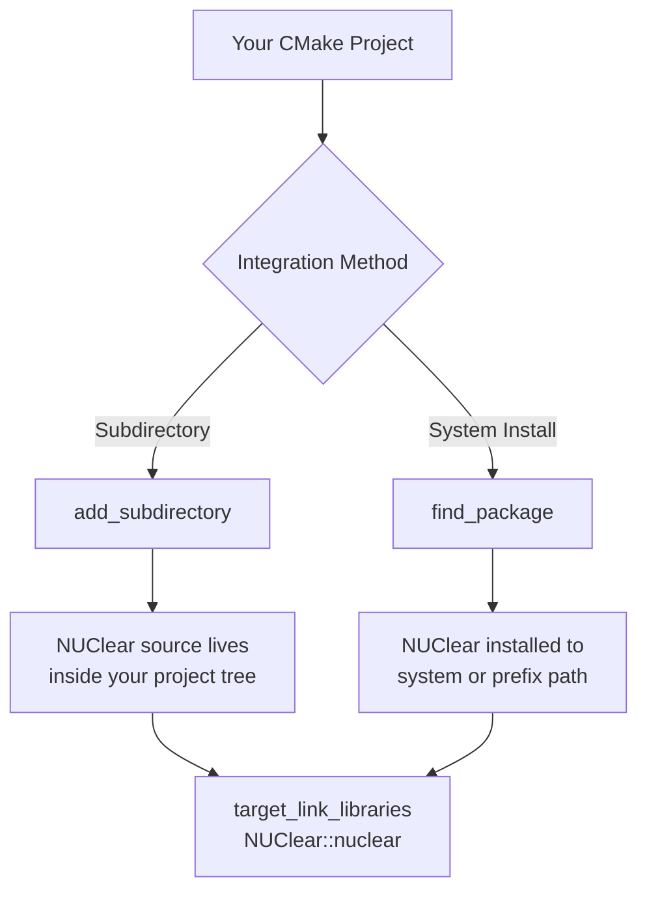

# Installation

This tutorial walks you through installing NUClear on your system and verifying that everything works. By the end, you'll have NUClear ready to use in your own CMake projects.

## Prerequisites

Before you begin, make sure you have the following tools installed:

| Requirement | Minimum Version | Purpose |
|-------------|----------------|---------|
| C++ compiler | C++17 support | Compiling NUClear and your project |
| CMake | 3.15 | Build system |
| Git | Any recent version | Cloning the repository |

## Installing Dependencies

=== "Ubuntu/Debian"

    ```bash
    sudo apt update
    sudo apt install -y build-essential cmake git
    ```

    Verify your compiler supports C++17:

    ```bash
    g++ --version
    ```

    !!! note
        You need GCC 7 or later for C++17 support. Ubuntu 18.04+ ships with GCC 7 by default.

=== "macOS"

    ```bash
    brew install cmake git
    ```

    The Xcode Command Line Tools provide the C++ compiler:

    ```bash
    xcode-select --install
    ```

    !!! note
        Apple Clang 10+ (Xcode 10+) supports C++17. Verify with `clang++ --version`.

=== "Windows"

    1. Install [Visual Studio 2019](https://visualstudio.microsoft.com/) or later with the **Desktop development with C++** workload.
    2. Install [CMake](https://cmake.org/download/) (3.15 or later). Ensure it is added to your PATH.
    3. Install [Git for Windows](https://git-scm.com/download/win).

    !!! note
        MSVC 19.14+ (Visual Studio 2017 15.7+) supports C++17, but Visual Studio 2019 or later is recommended.

## Clone the Repository

```bash
git clone https://github.com/Fastcode/NUClear.git
cd NUClear
```

!!! tip
    If you want a specific release, check out a tag after cloning:

    ```bash
    git tag -l
    git checkout v1.0.0
    ```

## Integration Approaches

There are two ways to use NUClear in your project:



Choose **subdirectory** if you want a self-contained project with no system-level installation. Choose **system install** if you want to share a single NUClear installation across multiple projects.

## Option A: Using as a Subdirectory

This approach bundles NUClear directly into your project — no installation step needed.

### 1. Add NUClear to Your Project

Place the NUClear source as a subdirectory of your project (e.g. as a git submodule):

```bash
cd /path/to/your/project
git submodule add https://github.com/Fastcode/NUClear.git vendor/NUClear
```

### 2. Configure Your CMakeLists.txt

```cmake
cmake_minimum_required(VERSION 3.15)
project(MyProject LANGUAGES CXX)

add_subdirectory(vendor/NUClear)

add_executable(my_app main.cpp)
target_link_libraries(my_app PRIVATE NUClear::nuclear)
```

!!! tip
    You can also use CMake's `FetchContent` module to download NUClear automatically:

    ```cmake
    include(FetchContent)
    FetchContent_Declare(
      NUClear
      GIT_REPOSITORY https://github.com/Fastcode/NUClear.git
      GIT_TAG        main
    )
    FetchContent_MakeAvailable(NUClear)
    ```

## Option B: System-wide Install

### 1. Build NUClear

=== "Ubuntu/Debian"

    ```bash
    cd NUClear
    mkdir build && cd build
    cmake .. -DCMAKE_BUILD_TYPE=Release
    cmake --build .
    ```

=== "macOS"

    ```bash
    cd NUClear
    mkdir build && cd build
    cmake .. -DCMAKE_BUILD_TYPE=Release
    cmake --build .
    ```

=== "Windows"

    ```powershell
    cd NUClear
    mkdir build
    cd build
    cmake .. -DCMAKE_BUILD_TYPE=Release
    cmake --build . --config Release
    ```

### 2. Install

=== "Ubuntu/Debian"

    ```bash
    sudo cmake --install .
    ```

=== "macOS"

    ```bash
    sudo cmake --install .
    ```

=== "Windows"

    Run in an **Administrator** command prompt:

    ```powershell
    cmake --install . --config Release
    ```

!!! tip "Custom install prefix"
    To install to a custom location instead of the system default:

    ```bash
    cmake .. -DCMAKE_INSTALL_PREFIX=/path/to/install
    cmake --build .
    cmake --install .
    ```

    Then tell your project where to find it:

    ```bash
    cmake .. -DCMAKE_PREFIX_PATH=/path/to/install
    ```

### 3. Use in Your Project

```cmake
cmake_minimum_required(VERSION 3.15)
project(MyProject LANGUAGES CXX)

find_package(NUClear REQUIRED)

add_executable(my_app main.cpp)
target_link_libraries(my_app PRIVATE NUClear::nuclear)
```

## Verification

Create a minimal program to verify your installation works.

### 1. Create a Test File

Create `main.cpp`:

```cpp
#include <nuclear>

class HelloReactor : public NUClear::Reactor {
public:
    explicit HelloReactor(std::unique_ptr<NUClear::Environment> environment)
        : NUClear::Reactor(std::move(environment)) {

        on<Startup>().then([this] {
            log<INFO>("NUClear is installed and working!");
            // Request shutdown after printing
        });
    }
};

int main() {
    NUClear::Configuration config;
    config.default_pool_concurrency = 1;
    NUClear::PowerPlant plant(config);
    plant.install<HelloReactor>();
    plant.start();
    return 0;
}
```

### 2. Create a CMakeLists.txt

```cmake
cmake_minimum_required(VERSION 3.15)
project(NUClearTest LANGUAGES CXX)

find_package(NUClear REQUIRED)

add_executable(nuclear_test main.cpp)
target_link_libraries(nuclear_test PRIVATE NUClear::nuclear)
```

### 3. Build and Run

=== "Ubuntu/Debian"

    ```bash
    mkdir build && cd build
    cmake ..
    cmake --build .
    ./nuclear_test
    ```

=== "macOS"

    ```bash
    mkdir build && cd build
    cmake ..
    cmake --build .
    ./nuclear_test
    ```

=== "Windows"

    ```powershell
    mkdir build
    cd build
    cmake ..
    cmake --build . --config Release
    .\Release\nuclear_test.exe
    ```

You should see output similar to:

```
NUClear is installed and working!
```

!!! warning
    If you used a custom install prefix, remember to pass `-DCMAKE_PREFIX_PATH=/path/to/install` when configuring your test project.

## Troubleshooting

??? "CMake cannot find NUClear (`Could not find a package configuration file provided by "NUClear"`)"
    This means CMake cannot locate `NUClearConfig.cmake`. Solutions:

    - Ensure you ran `cmake --install .` in the NUClear build directory.
    - Pass the install location explicitly: `cmake .. -DCMAKE_PREFIX_PATH=/path/to/install`
    - Check that the install path contains `lib/cmake/NUClear/NUClearConfig.cmake`.

??? "Compiler errors about C++17 features"
    NUClear requires C++17. Ensure your compiler supports it and that your project enables it:

    ```cmake
    target_compile_features(my_app PRIVATE cxx_std_17)
    ```

    Or set the standard globally:

    ```cmake
    set(CMAKE_CXX_STANDARD 17)
    set(CMAKE_CXX_STANDARD_REQUIRED ON)
    ```

??? "Linker errors about undefined references to `pthread`"
    On Linux, you may need to link the threading library:

    ```cmake
    find_package(Threads REQUIRED)
    target_link_libraries(my_app PRIVATE NUClear::nuclear Threads::Threads)
    ```

    !!! note
        The `NUClear::nuclear` target should propagate this dependency automatically. If you see this error, ensure you're using `target_link_libraries` with the `NUClear::nuclear` target (not just `nuclear`).

??? "Permission denied during install on Linux/macOS"
    The default install prefix (`/usr/local`) requires root permissions:

    ```bash
    sudo cmake --install .
    ```

    Alternatively, use a user-writable prefix:

    ```bash
    cmake .. -DCMAKE_INSTALL_PREFIX=$HOME/.local
    cmake --build .
    cmake --install .
    ```

## Next Steps

With NUClear installed, you're ready to build your first reactor. Continue to [Your First Reactor](first-reactor.md) to learn how to create reactive components.
